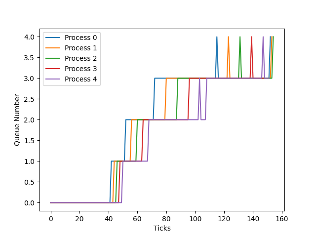

##  Prisha 

*  Running the OS
    
    * Install qemu
    * Terminal Commands :
        * > `make clean`  
        * > `make qemu SCHEDULER={SCHEDULER} CPUS={NUMBER}`  
        * Here SCHEDULER can be:
            * RR- Round Robin (default if no scheduler is specified)
            * FCFS - First Come First Serve
            * PBS - Priority Based Scheduling
            * LBS - Lottery Based Scheduling
            * MLFQ - Multi Level Feedback Queue Scheduling

# SYSTEM CALLS

* trace

    ```C
        int trace(int mask_value);
    ```
    > ` strace mask command [args]`
    * It intercepts and records the system calls which are called by a process during its
    execution.
    * User program strace added which runs the specified command till it exits.
    * Made changes to sysproc.c, usys.pl, syscall.c, syscall.h and user.h.  

    * Changes made to implement trace:
        * Edited &nbsp; ```sysproc.c``` to add function &nbsp; ```sys_trace()```.
        * Edited &nbsp; ```syscall.c```  and &nbsp; ```syscall.h``` to add the system call &nbsp; ```trace```.
        * Created &nbsp; ```strace.c```
        in &nbsp; ```user``` to add the user program &nbsp; ```strace() ```.
        * Edited &nbsp; ```usys.pl``` to add system call &nbsp; ```trace```.
         // user.h mei prototypew
 
* sigalarm and sigreturn
    
    ```C
        int sigalarm(int interval, void (*handler)());
        int sigreturn();
    ```

    * Added the system calls sigalarm and sigreturn.
    * sigalarm periodically interrupts the function after interval ticks and calls the handler function.
    * sigreturn resets the process state to before the handler function was called.
    * Made changes to sysproc.c, proc.c and trap.c.
    * Changes made to implement sigalarm and sigreturn:
        * Edited &nbsp; ```sysproc.c``` to add the functions &nbsp; ```sys_sigalarm()``` and &nbsp; ```sys_sigreturn()```.
        * Edited &nbsp; ```usys.pl``` to add system calls &nbsp; ```sigalarm``` and &nbsp; ```sigreturn```.
        * Added &nbsp; ```int sig_alarm_flag```, &nbsp; ```int input_ticks```, &nbsp; ```int count_ticks ```, &nbsp; ```uint64 handler ``` and &nbsp; ```struct trapframe *trapframe_temp;``` in &nbsp; ```proc.h```.
        * Initialised the newly added variable in &nbsp; ```allocproc()``` in &nbsp; ```proc.c```.
        *  Edited &nbsp; ```usertrap()``` in &nbsp; ```trap.c``` to reset alarm conditions after interrupt occurs.

# SCHEDULING

* First Come First Serve (FCFS)
    * FCFS is a non-preemptive scheduling algorithm which schedules the process that comes first without giving any particular priority to a process.
    * Changes made to implement FCFS:
        * Added &nbsp; ```createTime```  to &nbsp; ```struct proc``` in &nbsp; ```proc.h``` to store the creation time of a process.
        * Initialised the newly added variable in &nbsp; ```allocproc()``` in &nbsp; ```proc.c```.
        * Ran a for loop in &nbsp; ```scheduler()``` in order to select a runnable process with the lowest creation time to implement the FCFS algorithm.
        *  Added &nbsp; ```#ifdef``` conditions in &nbsp; ```kerneltrap()``` in &nbsp; ```trap.c``` to disable preemption.

* Lottery Based Scheduling (LBS)
    * LBS is a preemptive scheduling algorithm that assigns a time slice to the process randomly in proportion to the number of tickets it owns. That is the probability that the process runs
    in a given time slice is proportional to the number of tickets owned by it.

    * Changes made to implement LBS: 
        * Added &nbsp; ```int tickets``` to &nbsp; ```struct proc``` in &nbsp; ```proc.h``` to store the number of tickets a process has.
        * Initialised the newly added variable in &nbsp; ```allocproc()``` in &nbsp; ```proc.c```.
        * Added &nbsp; ```#ifdef``` conditions to &nbsp; ```scheduler()``` to implement LBS.
            * Declared and initialsed the variables &nbsp; ```total_tickets``` and &nbsp; ```lottery```. 
            * ```total_tickets``` stores the total number of tickets owned by all processes.
            * The &nbsp; ```random()``` fuction in proc.c assigns a random lottery number to &nbsp; ```lottery```.
            * We check which process has higher number of tickets by subtracting &nbsp; ```p->tickets``` from &nbsp; ```lottery``` and checking which process makes it negative, since a process with higher number of tickets is more likely to make &nbsp; ```lottery``` negative and thus it is scheduled.
        * Interrupts are enabled for LBS scheduling since it is preeptive. Thus added LBS to the &nbsp; ```#ifdef``` for allowing interrupts in &nbsp; ```kerneltrap()``` in &nbsp; ```trap.c```.
        * Added the system call &nbsp; ```settickets``` to set the tickets for a calling process.

* Priority Based Scheduler (PBS)
    * PBS is a non-preemptive priority-based scheduling algorithm that selects the process with the highest priority (lowest &nbsp; ```dynamic_priority```) for execution. 
    * In case two or more processes have the same priority, we use the number of times the process has been scheduled to break the tie. 
    * If the tie remains, we use &nbsp; ```createTime``` of the process to break the tie.

    * Changes made to implement PBS:
        * Added &nbsp; ```exitTime, runTime, waitTime, sleepTime, sleepTime, totalRunTime, num_runs, priority ``` to &nbsp; ```struct proc``` in &nbsp; ```proc.h``` to store the required parameters a process needs for PBS scheduling.
        * Initialised the newly added variable in &nbsp; ```allocproc()``` in &nbsp; ```proc.c```.
        * Added &nbsp; ```#ifdef``` conditions to &nbsp; ```scheduler()``` to implement PBS.
            * We wish to find the process with the minimum &nbsp; ```dynamic_priority```. Thus, it is first initialised to 101 (the max priority).
            * For each process, we calculate the niceness of the process given by the formula 
            > niceness = Int (Ticks spent in (sleeping) state / Ticks spent in (sleeping + running) state) * 10
            * We then calculate dynamic priority using the formula (DP is dynamic priority and SP is static priority)
            > DP = max(0, min(SP - niceness + 5, 100))
            <br>
            * The comparing priority is taken to be the dynamic priority of a process.
            * We select a process based on the above given tie-breaking conditions and schedule it.
            *  Added &nbsp; ```#ifdef``` conditions in &nbsp; ```kerneltrap()``` in &nbsp; ```trap.c``` to disable preemption.

        * Implemented the &nbsp; ```set_priority``` system call which resets niceness to 5 and returns the old static priority.
        * Implemented the user program &nbsp; ```setpriority``` to run the system call.

* Multi Level Feedback Queue Scheduler (MLFQ)
    * MLFQ is a preemptive scheduling algorithm that allows processes to move between different priority queues based on their behaviour and CPU bursts.

    * Changes made to implement MLFQ (in proc.h, proc.c and trap.c):
        * Added &nbsp; ```int queue_priority, int in_queue, in time_quanta, int nrun, int qitime, int qrtime[5]``` to struct proc in &nbsp; ```proc.h```. 
        * Declared an array &nbsp; ```struct queue``` &nbsp; ```mlfq[5]``` in &nbsp; ```proc.c```.
        * Defined standard queue operation functions like pop and push in &nbsp; ```proc.c```. Initialised each queue in the array (the &nbsp; ```head, tail and no_processes```).
        * Initialised the added parameters for MLFQ in &nbsp; ```allocproc()``` in &nbsp; ```proc.c```.
        * MLFQ was implemented as follows:
            * On the initiation of a process, it is pushed to the end of the highest priority queue (queue 0).
            * Process in highest priority non empty queues are scheduled.
            * If the process uses the complete time slice assigned for its current priority queue, it is preempted and inserted at the end of the next lower level queue.
            * If a process voluntarily relinquishes control of the CPU(eg. For doing I/O), it leaves the queuing network, and when the process becomes ready again after the I/O, it is inserted at the tail of the same queue, from which it is relinquished earlier.
            * A round-robin scheduler is used for processes at the lowest priority queue.
            * To prevent starvation, aging is implemented where if the process waits for more than 64 ticks, it's priority is increased.

    * Answer to the question:
        * MLFQ scheduling is based on the timeslice used by a process.
        * If a process has used all its time quanta, then the process is demoted to a lower priority queue.
        * When a process leaves CPU to perform an I/O, it is possible it uses up its timeslice and is demoted. However, by adding the process at the end of the queue it was already present in, this can be prevented.
        * Thus the process wont have to wait for a longer time in order to get CPU attention after finishing its I/O bursts.

# COPY ON WRITE       
* Cow fork will creates just a page table for the child , with PTEs for user memory pointing to the parent’s pa. Cow fork will marks all the user PTEs in both parent and child as not writable. When either process wants to write any of these unwritable pages, will triggle a page fault .The kernel trap will handle this fault , allocates a page of physical memory for the page fault,copies the original page into the new page, and modifies the relevant PTE in the faulting process to refer to the new page.

* To acheive the above goal changes were made to uvmcopy in vm.c where the copy of page table was created and pointer pointed out to the new copy , previous page was freed as by kfree.

* We maintain the refcnt(reference count array ) for every physical page .In the initialization , the refcnt will be writedto 1,because in the freerange ,we call kfree which decreases the refcnt for every pa.

* Increase refcnt and kfree is a combination , which is increase the refcnt of the pa , the other is decrease the refcnt of the pa .In the case when the refcnt of the pa down to zero , we would then free the pa .

* Kalloc function will allocate a pa , if the pa ref cnt is not valid , ie if it's already non zero then it gives panic since can it be already allocated memory.

* Now in trap.c we handled the page fault as he r_scause of page fault is 15 or 13. In usertrap , we have cowfault function that handles it .

* handle the invalid va , more than MAXVA , not in the page table ,not set user bit or valid bit
allocate a new pa , copy the original content to the new pa , unmap and map for this pte entry!


#  Analysis:


 **Benchmarking**
 <br>
 Results as obtained by running scheduler on single CPU

  |         Scheduler         | rtime   | wtime   |
  | :-----------------------: | :-----: | :-----: |
  |        Round robin        |   13   |     151   |
  |  First come first serve   |   23    |   106   |
  | Priority based scheduler  |   16    |   134   |
  | Multilevel Feedback queue |   11    |   146   |
  | Lottery based scheduler |   13  |   150  |

<br>
 Results as obtained by running scheduler on 2 CPU's

|         Scheduler         | rtime   | wtime   |
  | :-----------------------: | :-----: | :-----: |
  |  First come first serve   |   25    |   51   |
  | Priority based scheduler  |   11    |   109   |


# MLFQ Analysis Plot

* The following plot is obtained on performing MLFQ.


    

